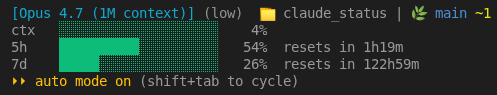

# My Claude Code Statusline

To install on your machine: open Claude Code, then copy the entire fenced prompt block from [`statusline.md`](./statusline.md) and paste it into your Claude Code session — Claude will set everything up for you.

## What it looks like

## Disclaimer

This is a personal configuration shared as-is, with no warranty of any kind. Review the install steps in [`statusline.md`](./statusline.md) before running them.